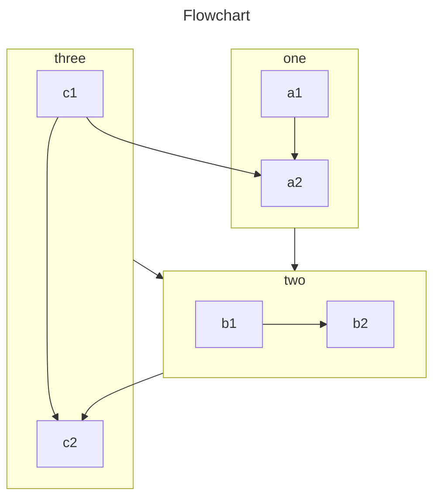

VuePress 主要從 Markdown 文件生成頁面。因此，你可以使用它輕鬆生成文檔或網誌網站。

你應該創建和編寫 Markdown 文件，以便 VuePress 可以根據文件結構將它們轉換為不同的頁面。

<!-- more -->

## Markdown 介紹

如果你是一個新手，還不會編寫 Markdown，請先閱讀 [Markdown 介紹](https://theme-hope.vuejs.press/zh/cookbook/markdown/) 和 [Markdown 範例](https://theme-hope.vuejs.press/zh/cookbook/markdown/demo.html)。

## Markdown 配置

VuePress 通過 Frontmatter 為每個 Markdown 頁面引入配置。

::: important Frontmatter

Frontmatter 是 VuePress 中很重要的一個概念，請閱讀 [Frontmatter 介紹](https://theme-hope.vuejs.press/zh/cookbook/vuepress/page.html#front-matter) 了解詳情。

:::

## Markdown 擴展

VuePress 會使用 [markdown-it](https://github.com/markdown-it/markdown-it) 來解析 Markdown 内容，因此可以借助於 markdown-it 外掛程式來實現 [語法擴展](https://github.com/markdown-it/markdown-it#syntax-extensions) 。

### VuePress 擴展

為了豐富文檔寫作，VuePress 對 Markdown 語法進行了擴展。

關於這些擴展，請閱讀 [VuePress 中的 Markdown 擴展](https://theme-hope.vuejs.press/zh/cookbook/vuepress/markdown.html)。

### 主題擴展

通過 [`vuepress-plugin-md-enhance`][md-enhance]，主題擴展了更多 Markdown 語法，提供更加豐富的寫作功能。

#### 提示容器

::: v-pre

安全的在 Markdown 中使用 {{ variable }}。

:::

::: info 自定義標題

資訊容器，包含 `程式碼` 與 [連結](#提示容器)。

```js
const a = 1;
```

:::

::: tip 自定義標題

提示容器

:::

::: warning 自定義標題

警告容器

:::

::: caution 自定義標題

危险容器

:::

::: details 自定義標題

詳情容器

:::

- [查看詳情](https://theme-hope.vuejs.press/zh/guide/markdown/hint.html)

#### 程式碼區塊

::: code-tabs

@tab pnpm

```bash
pnpm add -D vuepress-theme-hope
```

@tab yarn

```bash
yarn add -D vuepress-theme-hope
```

@tab:active npm

```bash
npm i -D vuepress-theme-hope
```

:::

- [查看詳情](https://theme-hope.vuejs.press/zh/guide/markdown/code-tabs.html)

#### 上下標

19^th^ H~2~O

- [查看詳情](https://theme-hope.vuejs.press/zh/guide/markdown/sup-sub.html)

#### 自定義對齊

::: center

我是居中的

:::

::: right

我在右對齊

:::

- [查看詳情](https://theme-hope.vuejs.press/zh/guide/markdown/align.html)

#### Attrs

一個擁有 ID 的 **單詞**{#word}。

- [查看詳情](https://theme-hope.vuejs.press/zh/guide/markdown/attrs.html)

#### 註解

此文字有註解[^first].

[^first]: 這是註解内容

- [查看詳情](https://theme-hope.vuejs.press/zh/guide/markdown/footnote.html)

#### 標記

你可以標記 ==重要的内容== 。

- [查看詳情](https://theme-hope.vuejs.press/zh/guide/markdown/mark.html)

#### 任務列表

- [x] 計划 1
- [ ] 計划 2

[查看詳情](https://theme-hope.vuejs.press/zh/guide/markdown/tasklist.html)

### 圖片增强

支持為圖片設置顏色模式和大小

- [查看詳情](https://theme-hope.vuejs.press/zh/guide/markdown/image.html)

#### 元件

```component VPCard
title: Mr.Hope
desc: Where there is light, there is hope
logo: https://mister-hope.com/logo.svg
link: https://mister-hope.com
background: rgba(253, 230, 138, 0.15)
```

- [查看詳情](https://theme-hope.vuejs.press/zh/guide/markdown/component.html)

#### 導入文件

<!-- @include: ./README.md{11-17} -->

- [查看詳情](https://theme-hope.vuejs.press/zh/guide/markdown/include.html)

#### 樣式化

向 Mr.Hope 捐贈一杯咖啡。 _Recommended_

- [查看詳情](https://theme-hope.vuejs.press/zh/guide/markdown/stylize.html)

#### TeX 語法

$$
\frac {\partial^r} {\partial \omega^r} \left(\frac {y^{\omega}} {\omega}\right)
= \left(\frac {y^{\omega}} {\omega}\right) \left\{(\log y)^r + \sum_{i=1}^r \frac {(-1)^i r \cdots (r-i+1) (\log y)^{r-i}} {\omega^i} \right\}
$$

- [查看詳情](https://theme-hope.vuejs.press/zh/guide/markdown/tex.html)

#### 圖表

::: chart 一個散布圖案例

```json
{
  "type": "scatter",
  "data": {
    "datasets": [
      {
        "label": "散點數據集",
        "data": [
          { "x": -10, "y": 0 },
          { "x": 0, "y": 10 },
          { "x": 10, "y": 5 },
          { "x": 0.5, "y": 5.5 }
        ],
        "backgroundColor": "rgb(255, 99, 132)"
      }
    ]
  },
  "options": {
    "scales": {
      "x": {
        "type": "linear",
        "position": "bottom"
      }
    }
  }
}
```

:::

- [查看詳情](https://theme-hope.vuejs.press/zh/guide/markdown/chartjs.html)

#### ECharts

::: echarts 一個折線圖案例

```json
{
  "xAxis": {
    "type": "category",
    "data": ["Mon", "Tue", "Wed", "Thu", "Fri", "Sat", "Sun"]
  },
  "yAxis": {
    "type": "value"
  },
  "series": [
    {
      "data": [150, 230, 224, 218, 135, 147, 260],
      "type": "line"
    }
  ]
}
```

:::

- [查看詳情](https://theme-hope.vuejs.press/zh/guide/markdown/echarts.html)

#### 流程圖

```flow
cond=>condition: 是否執行操作?
process=>operation: 操作
e=>end: 結束

cond(yes)->process->e
cond(no)->e
```

- [查看詳情](https://theme-hope.vuejs.press/zh/guide/markdown/flowchart.html)

#### MarkMap

````markmap
---
markmap:
  colorFreezeLevel: 2
---

# markmap

## 連結

- <https://markmap.js.org/>
- [GitHub](https://github.com/markmap/markmap)

## 功能

- 連結
- **强調** ~~删除線~~ *斜體* ==高亮==
- 多行
  文字
- `行内程式碼`
-
    ```js
    console.log('code block');
    ```
- Katex
  - $x = {-b \pm \sqrt{b^2-4ac} \over 2a}$
- 現在我們可以通過 `maxWidth` 選項自動換行非常非常非常非常非常非常非常非常非常非常長的内容
````

- [查看詳情](https://theme-hope.vuejs.press/zh/guide/markdown/markmap.html)

#### Mermaid



- [查看詳情](https://theme-hope.vuejs.press/zh/guide/markdown/mermaid.html)

#### 程式碼範例

::: normal-demo 一個普通 Demo

```html
<h1>VuePress Theme Hope</h1>
<p><span id="very">非常</span>强大!</p>
```

```js
document.querySelector("#very").addEventListener("click", () => {
  alert("非常强大");
});
```

```css
span {
  color: red;
}
```

:::

- [查看詳情](https://theme-hope.vuejs.press/zh/guide/markdown/demo.html)

#### 互動範例

::: playground#unocss UnoCSS 範例

@file index.html

```html
<div class="flex flex-col text-center h-full justify-center">
  <div class="text-red">TEST for default preset</div>
  <div class="text-$fd-color">TEST for custom css</div>
</div>
```

@file config.js

```js
import { defineConfig, presetUno } from "unocss";

export default defineConfig({
  presets: [presetUno()],
});
```

@file custom.css

```css
:root {
  --fd-color: green;
}
```

:::

- [查看詳情](https://theme-hope.vuejs.press/zh/guide/markdown/playground.html)

#### Kotlin 互動範例

::: kotlin-playground Simple Playground

@file main.kt

```kotlin
class Contact(val id: Int, var email: String)

fun main(args: Array<String>) {
    val contact = Contact(1, "mary@gmail.com")
    println(contact.id)
}
```

:::

- [View Detail](https://theme-hope.vuejs.press/zh/guide/markdown/kotlin-playground.html)

#### Vue 互動範例

::: vue-playground Vue 互動範例

@file App.vue

```vue
<script setup>
import { ref } from "vue";

const msg = ref("Hello World!");
</script>

<template>
  <h1>{{ msg }}</h1>
  <input v-model="msg" />
</template>
```

:::

- [查看詳情](https://theme-hope.vuejs.press/zh/guide/markdown/vue-playground.html)

#### Sandpack 互動範例

::: sandpack#vue Vue 範例

@file /src/App.vue

```vue
<script setup>
import { ref } from "vue";

const msg = ref("Hello Playground!");
</script>

<template>
  <h1>{{ msg }}</h1>
  <input v-model="msg" />
</template>
```

:::

- [查看詳情](https://theme-hope.vuejs.press/zh/guide/markdown/sandpack.html)

#### 投影片

@slidestart

## 投影片 1

一個有文字和 [連結](https://mister-hope.com) 的段落

---

## 投影片 2

- 項目 1
- 項目 2

---

## 投影片 3.1

```js
const a = 1;
```

--

## 投影片 3.2

$$
J(\theta_0,\theta_1) = \sum_{i=0}
$$

@slideend

- [查看詳情](https://theme-hope.vuejs.press/zh/guide/markdown/revealjs.html)

[md-enhance]: https://plugin-md-enhance.vuejs.press/zh/
