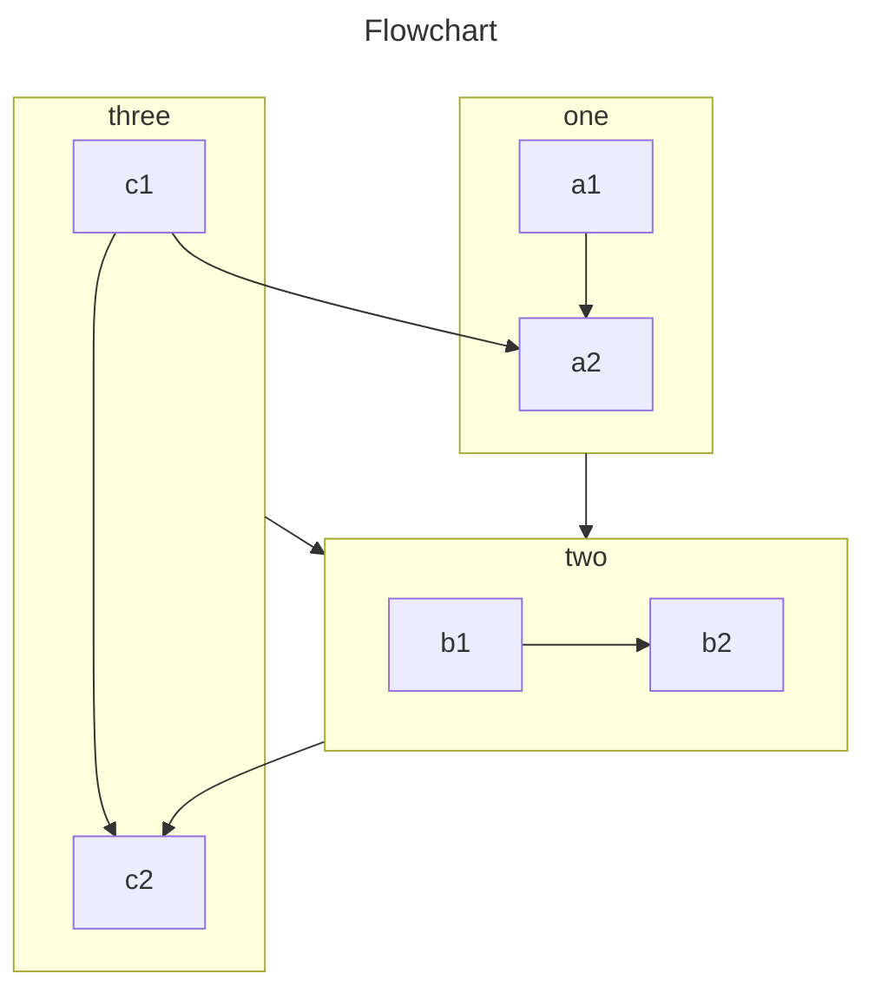

<!-- #region intro -->

此外掛程式提供了 6 種方法讓您將圖表插入到 Markdown 文件中。

- Chart.js：一個輕量級、易於使用、高度可定制的圖表庫。

  與 ECharts 相比，Chart.js 更輕量。

- ECharts：一個强大的、互動式的瀏覽器圖表和可視化庫。

  與 Chart.js 相比，ECharts 更强大。

- flowchart: Markdown 擴展，用於生成流程圖和序列圖。

  輕量級，只關注流程圖。

- Markmap: 從 Markdown 生成思维導圖

  運行環境非常重，不推荐使用。

- Mermaid：從 Markdown 生成圖表和流程圖。

  常用圖表的强大集合。

- Plantuml: 基於 Java 的 UML 圖表

  没有任何運行時，極其輕量。

<!-- #endregion intro -->

<!-- more -->

## 案例

<!-- #region demo -->

### Chart.js

::: chart 一個散布圖案例

```json
{
  "type": "scatter",
  "data": {
    "datasets": [
      {
        "label": "散點數據集",
        "data": [
          { "x": -10, "y": 0 },
          { "x": 0, "y": 10 },
          { "x": 10, "y": 5 },
          { "x": 0.5, "y": 5.5 }
        ],
        "backgroundColor": "rgb(255, 99, 132)"
      }
    ]
  },
  "options": {
    "scales": {
      "x": {
        "type": "linear",
        "position": "bottom"
      }
    }
  }
}
```

:::

- [查看詳情](./chartjs.md)

### ECharts

::: echarts 一個折線圖案例

```json
{
  "xAxis": {
    "type": "category",
    "data": ["Mon", "Tue", "Wed", "Thu", "Fri", "Sat", "Sun"]
  },
  "yAxis": {
    "type": "value"
  },
  "series": [
    {
      "data": [150, 230, 224, 218, 135, 147, 260],
      "type": "line"
    }
  ]
}
```

:::

- [查看詳情](./echarts.md)

### 流程圖

```flow
cond=>condition: 是否執行操作?
process=>operation: 操作
e=>end: 結束

cond(yes)->process->e
cond(no)->e
```

- [查看詳情](./flowchart.md)

### Markmap

````markmap
---
markmap:
  colorFreezeLevel: 2
---

# markmap

## 連結

- <https://markmap.js.org/>
- [GitHub](https://github.com/markmap/markmap)

## 功能

- 連結
- **强調** ~~删除線~~ *斜體* ==高亮==
- 多行
  文字
- `行内程式碼`
-
    ```js
    console.log('code block');
    ```
- Katex
  - $x = {-b \pm \sqrt{b^2-4ac} \over 2a}$
- 現在我們可以通過 `maxWidth` 選項自動換行非常非常非常非常非常非常非常非常非常非常長的内容
````

- [查看詳情](./markmap.md)

### Mermaid 圖表



- [查看詳情](./mermaid.md)

### Plantuml

@startuml
scale 5 as 150 pixels

clock clk with period 1
binary "啟用" as en
binary "讀/寫" as rw
binary "數據有效" as dv
concise "數據總線" as db
concise "地址總線" as addr

@6 as :write_beg
@10 as :write_end

@15 as :read_beg
@19 as :read_end

@0
en is low
db is "0x0"
addr is "0x03f"
rw is low
dv is 0

@:write_beg-3
en is high
@:write_beg-2
db is "0xDEADBEEF"
@:write_beg-1
dv is 1
@:write_beg
rw is high

@:write_end
rw is low
dv is low
@:write_end+1
rw is low
db is "0x0"
addr is "0x23"

@12
dv is high
@13
db is "0xFFFF"

@20
en is low
dv is low
@21
db is "0x0"

highlight :write_beg to :write_end #Gold:寫
highlight :read_beg to :read_end #lightBlue:讀

db@:write_beg-1 <-> @:write_end : 設置時間
db@:write_beg-1 -> addr@:write_end+1 : 保持
@enduml

- [查看詳情](./plantuml.md)

<!-- #endregion demo -->
