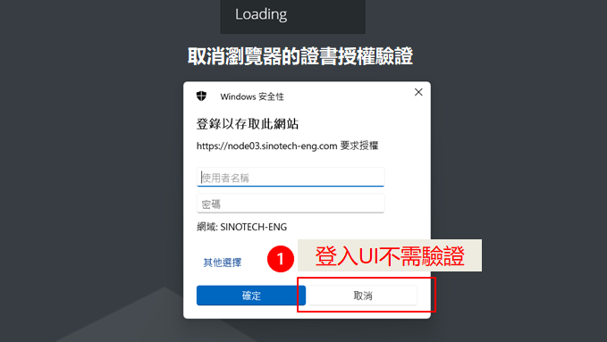
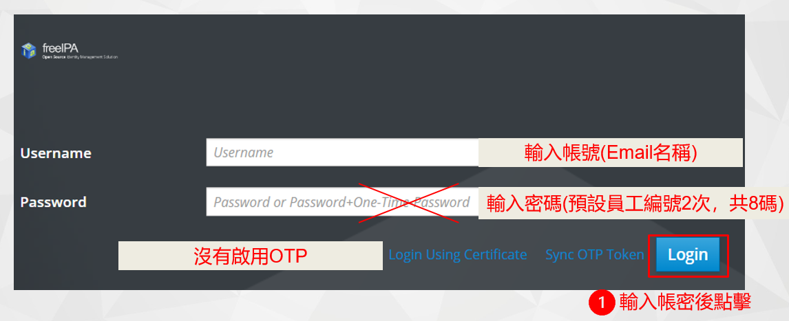
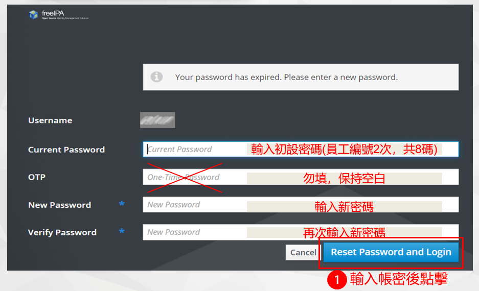
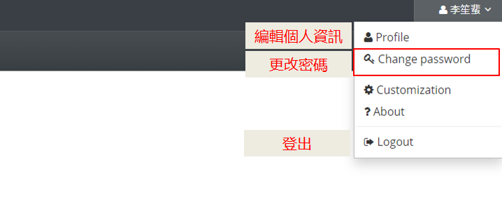

# FreeIPA說明

## 操作說明

### 如何登入 
- [系統超連結請點我](https://node03.sinotech-eng.com/ipa/ui/)


<br>每次訪問系統網址時會出現要求授權，這是系統其他服務的需求 <br>登入UI不需要，點擊取消


<br>輸入帳號及密碼，點擊login

### 初次登入須重設密碼

<br>第一次登入 系統會要求重設密碼，OTP不要填<br>輸入新密碼兩次後點擊登入

#### 密碼原則：
- 長度至少10碼
- 不能有員工編號
- 包含以下任三種字元：
    1. 英文大寫 
    2. 英文小寫
    3. 數字
    4. 特殊符號
- 詳細請見 ```S:\16資訊\新進人員注意事項.pptx```

### 修改密碼


<br>未來若需修改密碼請登入後點擊右上角▼更改

## 專案負責人
FreeIPA操作問題：李笙蜚(ext 10458)
其他任何問題：曠永銓(ext 20930)