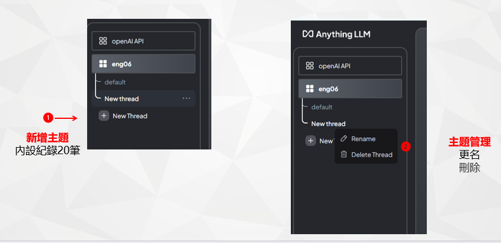
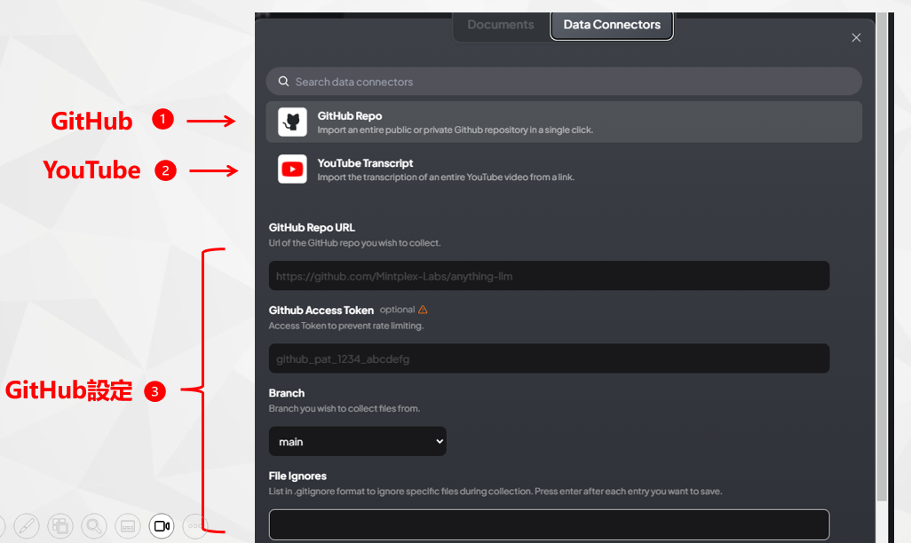

# 熟悉聊天機器人的界面

## 背景

### 特色

- AnythingLLM被稱為是使用者所需最後一個終極聊天機器人，具有開放性、可規模化、雲端地端整合性、大型LLM與小型嵌入引擎的整合、會員制與廣播制聊天機器人的整合、開放性生成與封閉性資料庫查詢的整合、靜態檔案連結與動態[RAG](https://sinotec2.github.io/AIEE/NLP/AnythingLLM/AnyChatDoc/#rag)的整合等等特色。
- AnythingLLM的服務介面林林總總，此處以最常用的對話介面為範圍主題進行說明。
  - 其他如[AI小幫手](./EmbChat.md)，雖然也有對話功能，但介面附加在其他網頁之內，且沒有帳密管理，服務功能也略有不足(範例詳見[旅遊補助網頁@devp](http://devp.sinotech-eng.com/emb.html))。
  - 除了系統本身UI之外，Anything LLM也提供了API批次呼叫的方式，進行更高階自動化的操作。
- AnythingLLM概念說明：可以詳見其[官網](https://useanything.com/)。
- 官網使用[說明文件](https://docs.useanything.com/)

### 系統的必要性

- 市面上已有免費的資源(openAI、Anthropic、microsoft Bingchat、Google Gemini等等系統)，為何還需要使用公司資源？

1. 無限制的檔案(網頁)連結與解析
2. 共用GPTs、共用API資源
3. 機敏資料使用地端GPT分析
4. 提供低廉、高品質的GPT練習機會

### 使用者權限

適應新的系統必須要先建立權責觀念、建立明確、良好的分際。

- AnythingLLM的使用者有3種角色。角色並不能新創或刪減。
- 內設(一般)使用者
  - 只能在管理員或[經理](AnyChat_mng.md)邀請的工作區內聊天。
  - 可以新增工作區內的主題(thread)，但不能連結到檔案、網頁、GH倉庫、影音或其他資料
  - 無法修改系統任何設定。
- [經理](AnyChat_mng.md)(與**檔案**有關)
  - 可以查看、建立和刪除任何工作區以及修改工作區特定的設定。
  - 可以建立檔案連結、創建目錄進行檔案管理。
  - 可以建立、更新和邀請新使用者加入工作區。
- [管理者](AnyChat_adm.md)(與**錢**有關)
  - 最高使用者等級權限。可以查看並執行整個系統中的所有操作。
  - 新增使用者、帳密、權限管理
  - 修改LLM、vectorDB、嵌入或其他連線與API金鑰等設定。

### 固定之入口網

- 公司內部官網[資訊服務](http://iiseng.sinotech-eng.com/sipEng/Home/ITService)
- 未來各組伺服器位置如有異動將不會另行通知，以官網[資訊服務]()公告及連結為準，儲存快捷列者請自行留意。

## GPTs統一入口界面程式

### 登入

- AnythingLLM目前沒有提供其他登入方式(如AD/LDAP等)的選項，只有其內部[經理](AnyChat_mng.md)/[管理者](AnyChat_adm.md)設定的帳密權限管理。
- 網址說明
  - 格式：`http://主機.網域:端口`
  - 主機：eng06
  - 網域：sinotech-eng.com
  - 端口為4位數，自3001~3014，各技術組有自己的端口，分配詳見[對應關係表](../node/add_users.md#對應關係表)。
- 權限角色：都使用相同界面登入，並無差別。
- 帳號設計
  - 電郵名稱(@左側部分)、方便[批次產生](../node/add_users.md)。
- 初設密碼：
  - 員編重複2次
  - AnythingLLM要求密碼至少需8碼、內容不限
- 畫面


1. 登入使用者。如不登出，本地網頁瀏覽器會記錄帳密。
2. 登入密碼。至少8碼
3. 登入(下次瀏覽器連線後，會自動登入)

### 畫面分區

- 一如其他chatbot的習慣，AnythingLLM的主畫面切分為2大部分，左側邊條除了設定(板手符號，只有[經理](AnyChat_mng.md)/[管理者](AnyChat_adm.md)看得到)及說明外，就是工作區(workspace, LLM、[經理](AnyChat_mng.md)級以上可以[新增](./AnyChat_mng.md#新增工作區))及其目錄下的主題(thread、所有人都可新增)
- 中間部分為對話區
  - 最下一行為使用者提問區，按下enter或紙飛機icon，則可輸入提問。
  - GPT回覆內容，如果沒有特別指定，一般對話紀錄為20筆。筆數需視選取的LLM而異，如果允許Token數較少，紀錄太多會妨礙其記憶體使用。
  - 輸入/輸出語言：視LLM及使用者自行約定而異，
- 右側個人區
  - 可修改頭像、變更密碼、登出
  - 如不登出，瀏覽器將會記憶帳密，下次點選網址不需再登入。
  - 如有安全顧慮([經理](AnyChat_mng.md)以上)，要記得**每次**使用完隨即登出
  


### 個人區與密碼管理

- 由於外部LLM的API是需要收費的，因此[經理](AnyChat_mng.md)級以上人員是有相應的管理責任，登入後強烈建議**更改密碼**。
- 點選右上角的頭像，可以進入個人區進行修改。
- 密碼只有最低長度的限制，其餘並無要求。
- 目前沒有提供忘記密碼的自動化補救措施，[管理者](AnyChat_adm.md)與[經理](AnyChat_mng.md)都有權限可以修改任密碼，可洽其中任何一位、包括修改帳號名稱。


### 切換/新增對話主題

- 在工作區下，任何人可以切換或新增對話主題(thread)，圍繞著特定文件檔案、或特定網頁內容。
- 不同使用者之間彼此看不到他人的對話紀錄，但
- 經理級以上人員可以看得到暫存區的檔案目錄及名稱(點選上載icon)，也可以選擇其他人上傳的檔案作為主題連結的對象。


- 新增主題名稱一律為"New Thread"。
- 新增主題後，可以在其右側`...`位置更名或刪除。
- 刪除後對話紀錄將會消失，使用者應自行儲存管理。



- 新增主題後，[經理](AnyChat_mng.md)層級以上會出現主題要連結的檔案(或連結)，
  - 這個連結只會出現在這裡，點入連結後會另開新的畫面。
  - 主題對話過程中，可以按工作區名稱右側的`上載`符號新增或改變。


- 如果語言模型出現“幻覺”回應、建議新增主題來更新記憶體。詳見官網的[FAQ：為什麼LLM沒有使用我給的文件](https://sinotec2.github.io/AIEE/NLP/AnythingLLM/AnyChatDoc/#faq)。

### 檔案、網頁與資料的連結

1. 既有檔案的連結
  - 過去所有使用者開啟的檔案，點選後，會出現使用的按鍵，需要按下「儲存至工作區」、或向右箭頭後，將其移到右側、按下**儲存與嵌入**（save and Embed），才會被GPT用以強化文本的產生([RAG](https://sinotec2.github.io/AIEE/NLP/AnythingLLM/AnyChatDoc/#rag))
  - 如果大型檔案，建議加註**工作區名稱**，讓其他使用者知道可以切換到該工作區，直接使用既有RAG解讀結果，避免重複上傳、解讀。
  - 一旦檔案被LLM讀取、機敏資料即上傳外流，外部API就會開始計費，因此**儲存與嵌入**需小心點擊。
2. 新增檔案：可以點擊開啟檔案、或拖拉放在虛線位置，
3. 網頁
  - 可以接受內部或外部的網址
  - 按下取回(fetch)後，可以將將其內容下載至系統資料庫中。
4. 開新目錄：如果檔案太多，不便連結，可以建立新資料夾。**資料夾批次上載比較容易成功。**
5. 除了檔案網頁外，也可以連結其他類資料，點選分頁後可進入另一畫面


### GH倉庫及影音檔案之連結

- AnythingLLM可以連結到GitHub的倉儲，此處輸入倉儲位置的網址以及通關密鑰(如為私人倉儲)。
- 連結到YouTube影音檔案，以進行逐字稿的轉錄(transcription)。
  - 轉錄後的檔案：會自行放在`youtube-transcripts`Folder下，需要再將檔案上載到工作區，才會作用。
- 如要下載轉錄結果，可以到`eng06:~/anythingllm??/documents/youtube-transcripts` (??=01~14)目錄尋找。
  - 檔案格式為json檔，範例如下

```json
{
    "id": "...",
    "url": "https://youtu.be/...",
    "title": "日本各地玩什麼？...",
    "description": "你去日本...",
    "docSource": "https://youtu.be/...",
    "chunkSource": "link://https://youtu.be/...",
    "published": "5/23/2024, 3:31:04 AM",
    "wordCount": 19,
    "pageContent": "日本全國..."
    "token_count_estimate": 6154
}
```



### 引述來源

- 如果對話引用到檔案、網頁或資料，系統可以顯示引述的來源
- 點選Show Citation > 顯示連結的內容(檔名)
- 點選連結：進入檔案文本、系統會出現符合度指標。


### 特殊對話功能

- `@`與`/`這2個特殊字元分別會開啟及關閉特殊代理功能，`@agent`開啟、一次開啟所有功能，`/exit`或`/reset`則會結束功能，也是一次全部結束。
- 按下畫面中`@`位置，會顯示工作區可以使用的所有特殊功能。GPT會用自然語言方式讓功能作用，不必自行切換。點擊功能列表，出現`@agent`後按下enter，隨即啟動特殊功能。


- 運作範例
  - 啟動畫面
  


- 最新消息：需要指引到特定的網站，搜尋該網的最新消息。


- 網頁內容的爬取、挖掘


## 工作區的建立與管理

- 除了檔案連結之外，工作區最主要的功能在語言模型(API計費方式)的連結與設定。
- 詳見[經理的權責#新增工作區](./AnyChat_mng.md#新增工作區)

## API金鑰的管理

### 更改金鑰的權限

- [經理](AnyChat_mng.md)可以選擇預設的語言模型，但**不能**新增或修改語言模型API金鑰。
- 詳見[管理者的權責#LLM偏好](AnyChat_adm.md#llm偏好)的設定方式。

### GPTs/API 申請表(草案)

- 如果有計畫資源可以支應API的費用，請循[生成式人工智慧付費帳號申請]()程序辦理。


1. 流程：申請人→部門主管→研資部→行政部(考核→財會)→核定(≦1,000部門主管，1,001~2,000責任中心主管，＞2,000總經理)→研資部→申請人
2. 申請者即為該GPTs或API之管理員，擁有一組帳密，並自行上網刷卡付費，管理方式及報銷請洽詢研資部。
   - 本表適用openAI的GPTs及(或)其他公司的API付費方案
   - 研資部將另外提供公司的電子郵件信箱，作為付費之專用帳號與聯繫所需，請款時也請列印帳單供參。
   - 請款方式詳洽研資部。
3. 執行期間如需展延，請重新填寫本表。當計畫執行結束時，請自行停用付費方案。若有逾期扣款，請自行負責。
   - 按全期經費預估結果之金額核定。
   - 全期經費≦1,000部門主管，1,001~2,000責任中心主管，＞2,000總經理
   - 如為月費方案，請小心管理。
4. 申請人與參與人員共享使用GPT帳號及密碼，並以Google Calendar管理使用時間。
   - 如為GPTs需填寫參與人員及google日曆的ID，以便進行GPTs使用時段之管理。
   - 如為API請填寫參與人員、群組或個人即可、不需要google日曆，API金鑰的管理範例詳見[API Token Usage Checking](https://eng06.sinotech-eng.com/v2/shared/zh/AnyChat_adm.html#api-token-usage-checking)。

### 專案負責人

- 人員異動：新進/離職/退休/換組，洽李宏輝(ext 10486)、黃怡臻(ext 10457)
- API金鑰：謝天霖(ext 10468)
- 其他任何問題：曠永銓(ext 20930)
