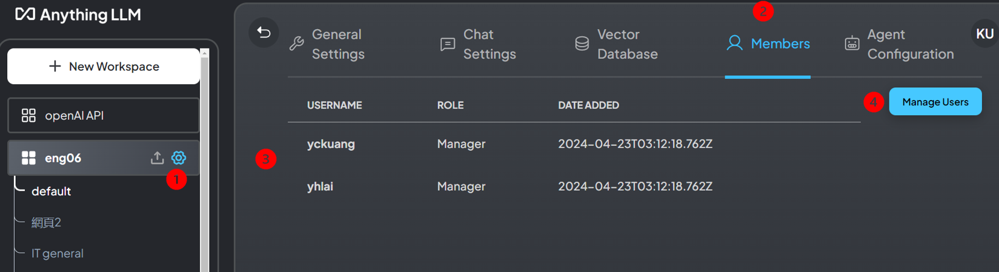
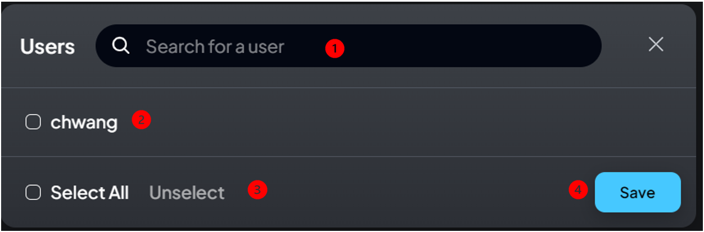

## 背景

- AnythingLLM概念說明：可以詳見其[官網](https://useanything.com/)、以及[使用說明文件](https://docs.useanything.com/)
- 如果沒有足夠的聊天機器人經驗，可以參考[AnythingLLM Chat](./AnyChat.md)以熟悉作業環境。

### 權限等級

- AnythingLLM的使用者有3種角色。這3種角色並不能新增或刪減。
- 內設(一般)使用者
  - 只能參與管理員或經理新增的工作區(workspace)聊天。
  - 新增工作區內的主題(thread)，**不能**連結到檔案、網頁、GH倉庫、影音或其他資料
  - 無法修改任何設定。
  - 此一使用者的功能，可以完全被[網頁AI小幫手](./EmbChat.md)取代，不一定需要帳號管理。
- 經理
  - 可以查看、建立和刪除任何工作區、修改工作區設定、以及部分系統設定。
  - 可以建立、更新和邀請新的使用者加入工作區。
- [管理者](AnyChat_adm.md)
  - 最高使用者等級權限。可以查看並執行整個系統中的所有操作。
  - 新增使用者、帳密、權限管理
  - 修改LLM、vectorDB、嵌入或其他連線與API token等設定。

### 經理與[管理者](AnyChat_adm.md)能夠設定的項目

- 詳見[anythingllm設定與權責](./AnyChat_adm.md#anythingllm設定與權責)

## 設定工作區

- 經理主要的權責在設定工作區的檔案及語言模型，特別是與使用者接觸的界面，雖然他也被授權部分的系統設定功能。

### 新增工作區

- 經理以上可以新增工作區，重新命名、刪除並進行工作區的設定。
- 經理不能更動內設的語言模型API金鑰。
- 工作區名稱右側齒輪：進入工作區的設定。

### 一般設定

1. 向量資料庫的總向量數：0表示沒有連結檔案。
2. 更名
3. 工作區前置訊息(先點+號)
4. 訊息內容
5. 儲存訊息
6. 刪除。對話及設定將會全數清除。

### 對話設定

- LLM提供者：可以選擇雲端或地端的LLM(2)，設定API、或指定GPT版本(3)。
- 對話模式(4)
  - 對話：優先RAG檔案內容回答，如超出範圍，則會儘量用語言模型的基本知識來回答問題。
  - 查詢：會以RAG檔案內容來回答問題，如超出範圍，則不回答。
- 對話歷史：內設為20，視語言模型的Token數而定(5)。
- 前提：是否臆測、回答的語調、潛在對象特質等等(6)。
- 溫度：只會針對工作區產生作用。一般設為0.7，如果要產生嚴謹的報告，需要降低LLM回答的溫度(7)。

### 向量資料庫

1. RAG檔案或其他輸入內容，將會以向量化模型來儲存，其資料庫在此設定。
2. 資料庫ID：內設與工作區名稱一致。
3. 最大文本片段：內設建議為4個片段
4. 文件相似度的界閥值：有不限、低、中、高等4種選項，相似度要求越高，回答越精準。
5. 重設

### 邀請(允許)工作區的使用者

- 經理級以上可以訪問所有的工作區，使用系統的LLM資源，不需要允許或邀請
- 每個工作區可以指定不同的使用群體，以區隔API資源的使用。
1. 按下齒輪進入工作區的設定
2. 成員(Members)
3. 目前成員清單：只有一般使用者需要給予訪問權，經理或[管理者](AnyChat_adm.md)不需要。
4. 管理成員，點入後進入另對話框

1. 從所有使用者中尋找符合的項目
2. 使用勾選的方式
3. 選擇所有使用者、取消選擇
4. 完成設定，儲存結果

### 代理者設定

1. 可用語言模型之選擇，目前有openAI、Anthropic等2個選項。
2. 可選擇開啟的代理者：存檔到網頁上，會有洩漏的風險。
3. 開啟網頁搜尋。
4. 有google(每天限100次)及serper.dev(超過2500次會開始收費)
5. 會需要輸入ID及token。可至指定連結免費申請。

## 經理的系統設定權責

- 經理按下左下角的板手，也可以進入系統的設定畫面，但是功能有限，只有[系統偏好設定](./AnyChat_adm.md#系統偏好設定)、[新使用者邀請連結](./AnyChat_adm.md#邀請連結)、[使用者](./AnyChat_adm.md#使用者管理)(其他經理及一般使用者)、工作區及對話紀錄、也可以管理系統的外觀，詳見管理者的[詳細說明](./AnyChat_adm.md)。

