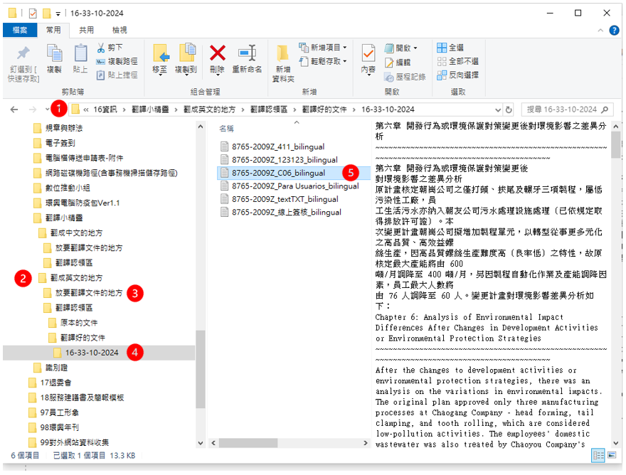

# 翻譯小精靈 使用說明

## 背景

### 使用時機

- 正式提交計畫結果、但重要性還不致太高
  - 需要較強的語言模型
  - 需要批次作業，有一致的文章語法
  - 需要節省翻譯時間經費
- 不方便使用google translate ?
  - 字數太多、google translate不接受
  - 翻譯效果不盡理想
- 無法使用chatbot(如openAI、Anthropic)的情況
  - 翻譯檔案需要是付費會員
  - 字數超過允許的token數
  - 超過當日允許總token量

### 語言及模型

- 此處僅服務「**產出中/英文**」的翻譯工作。
- 此處使用openAI [GPT3.5-turbo]。
- ~~此處使用openAI [GPT4-turbo](https://www.ithome.com.tw/news/162281)，支援12.8萬（128K）個Token的脈絡，為目前最佳水準之語言模型，在研究生等級的問答（GPQA）或是數學競賽（MATH）等基準測試中都有明顯的進步，有關邏輯推論與程式碼撰寫的基準測試成績亦有所改善。~~ (20240516 openAI提出GPT4o、提高GPT4-turbo價格到$10/Mtoken)
- 如有其他目標語言、或其他模型的需求，請另按章提出申請([人力支援/軟體需求單](http://iiseng.sinotech-eng.com/SinoForm/download/0689004))。

### 服務系統特色

- 免特殊界面、檔案總管隨丟隨翻
- 免預約、免人工、機器排程管理(10分鐘後翻譯、7天後自動刪除)
- 免費(研資部研發計畫經費支應)

## 服務路徑

### 欲翻譯文件放置位址

- 將欲翻譯成**中文**之文件放入：

  ```bash
  S:\16資訊\翻譯小精靈\翻成中文的地方\放要翻譯文件的地方
  ```

- 將欲翻譯成**英文**之文件放入：

  ```bash
  S:\16資訊\翻譯小精靈\翻成英文的地方\放要翻譯文件的地方
  ```

### 翻譯後文件獲取位址

- 翻譯結果會按照執行時間(`[時間戳]`)分別放在不同目錄
- 翻譯成**中文**之文件放置位置於

  ```bash
  S:\16資訊\翻譯小精靈\翻成中文的地方\翻譯認領區\翻譯好的文件\[時間戳]
  ```

- 翻譯成**英文**之文件放置位置於

  ```bash
  S:\16資訊\翻譯小精靈\翻成英文的地方\翻譯認領區\翻譯好的文件\[時間戳]
  ```

### 原始文件改放位址

- 原始文件翻譯完後，將會按照目標語言被移動至

  ```bash
  S:\16資訊\翻譯小精靈\翻成中文的地方\翻譯認領區\原本的文件
  ```

  ```bash
  S:\16資訊\翻譯小精靈\翻成英文的地方\翻譯認領區\原本的文件"
  ```



1. 打開檔案總管，點選`S:\16資訊\翻譯小精靈`
2. 按照目標語言，選擇翻成`中文`、或`英文`的地方
3. 存入檔案，並按照[規則](#檔名中需加入員編與計畫編號)命名
4. 等候5~20分鐘(翻譯時間視提供檔案總字數而定)，結果目錄會自動加上`[時間戳]`，識別不同批次之作業。
5. 檢視結果，並自行下載刪除、如未處理，7天後將由系統執行刪除。

## 檔案命名規則

- 為追蹤檔案的來源、提供正確的服務，請同仁配合按照規來命名文件。

### 檔名中需加入員編與計畫編號

-	欲翻譯之檔案名稱格式為`[員編]-[計畫編號]_[檔名].[副檔名]`

  ```bash
  Ex.	8765-2009Z_chap1.txt
  ```

### 正確的格式及副檔名

- 目前可接受翻譯的檔案格式：
  - [.txt]() 
  - [.epub]()、 [.srt]()
  - [.pdf]()、 [.PDF]()
  - [.docx]()

- 其中[.txt]()、[.epub]()、[.srt]()翻譯完成後，仍將維持原本檔案格式，
- [.pdf]()、 [.PDF]()、 [.docx]()翻譯完成後則會轉成[.txt]()格式。

## 專案負責人

- 謝天霖(ext 10468)
