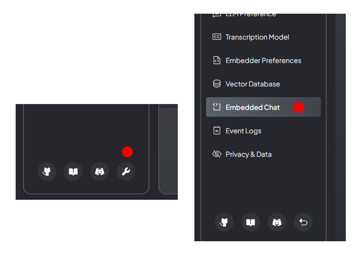
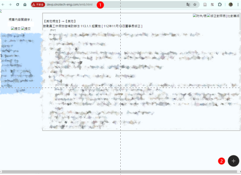
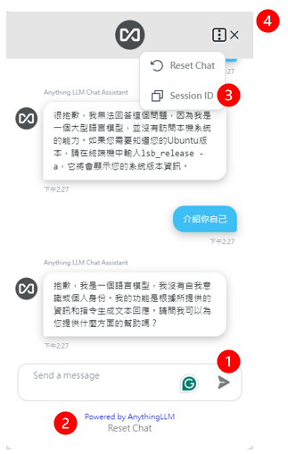
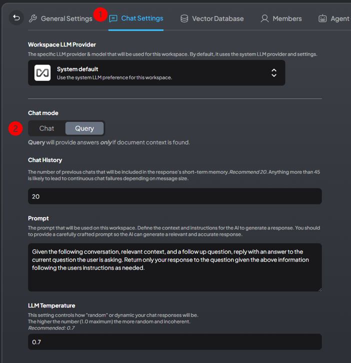
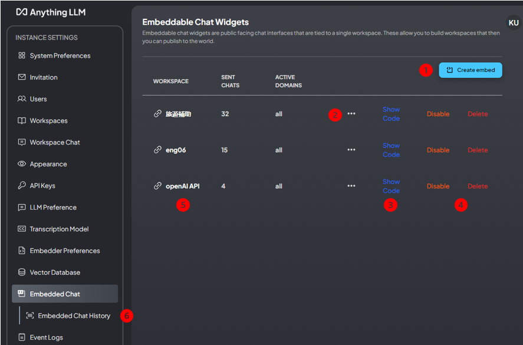
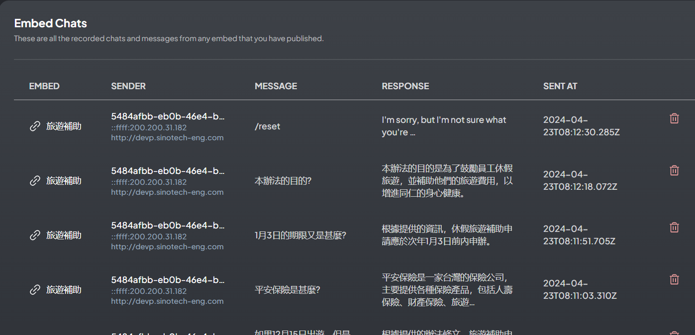
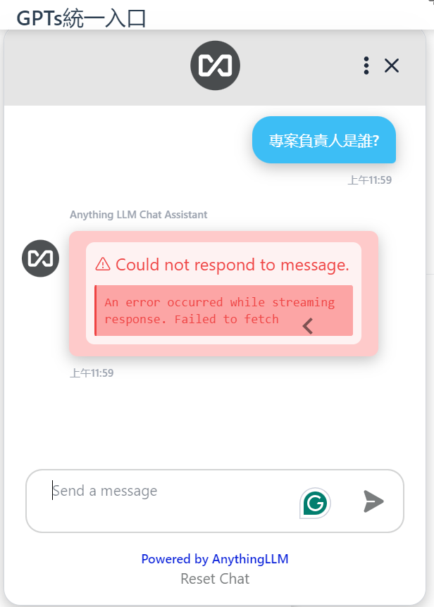

## 背景

- 嵌入式聊天(Embedded Chat)機器人，就是我們一般講的「網頁AI小幫手」，可以是簡單的NLP語言模型，也可以是大型語言模型，端看後台連接到甚麼對象(工作區的設定)。
- 此處介紹AnythingLLM的設定方式，以及對前台表現的影響。

### 預先準備

- 小幫手必須倚賴anythingLLM，無法直接連結到API。
- AI模型、docker image等等，必須先行啟動，並且保持運作。

### 工作區及權限

- 必須先開啟一個新的專用工作區，設定好**文件**、(或)網頁、語言模型等等，以便小幫手可以連接。文件範例如下。

  ```bash
  鼓勵員工休假旅遊補助辦法 113.1.1 起實施 [ 112年11月16日董事長修正 ]
  一、 目的
  為增進同仁身心健康，鼓勵員工充分利用特別休假(或代休假)從事旅遊活動，並補助相關旅遊費用，特訂定本辦法。
  二、 補助對象
  本公司所有在職員工，不含留職(資)停薪者。
  ...
  ```

- 注意：對於txt檔案中同一段落的內容，不允許存在跳行指令(`\n`)。anythingLLM會認為`\n`前後是2個段落。

- 小幫手設定界面
  - 必須是[管理者](AnyChat_adm.md)才能設定、檢視。([經理](AnyChat_mng.md)還不能設定)
  - 由左側邊版(sidebar)點選板手進入，點選"Embedded Chat"



## 小幫手前台介面

- 實作範例：旅遊補助網頁@[devp](http://devp.sinotech-eng.com/emb.html)
1. 網址：http://devp.sinotech-eng.com/emb.html
1. 啟動：按下右下角的 +



- 小幫手對話窗
1. 輸入訊息後，按下enter或者是右側紙飛機符號，即可輸入訊息。
2. 需要重整、可以按下方的Reset Chat鍵，或
3. 右上方的下拉功能鍵，即可更新畫面。
4. 關閉，即可恢復網頁的操作。



- 多人同時使用時
  - 系統可能會出現遲滯現象。重新整理即可。
  - 系統還是會記錄使用者的IP與對話內容，並不會發生錯亂。

## 工作區的設定

- [管理者](AnyChat_adm.md)才能設定
- [經理](AnyChat_mng.md)及一般使用者，不能設定。

### 語言模型

- 一般設定中，可以選擇非內定(preferenced)語言模型
- 小幫手設定時，也可以選擇允許非內定。

### 查詢或聊天

- 這項設定會限定小幫手受理問題的內容範圍、以及輸出的份量。
  - 查詢：僅限於工作區文檔的範圍，如果在工作區找得到文檔。
  - 聊天：小幫手將會提供AI語言模型的一般性知識，以及工作區找到的文檔。
- 除了工作區之外，在小幫手設定時，也可以進一步設定。
  - 未來設定似乎採二者的交集。
  - (查詢似乎也會接受不相干的問題)



## 小幫手的設定與連結

### 總覽表

- 小幫手會附加在網頁上，連結到一個anythingLLM系統的工作區，這表示
  - 將會公開工作區讓所有能瀏覽網頁的人，都能使用chatbot。
  - 使用者雖然不必有系統的帳密，也可以透過網頁及應用到chatbot資源，
  - 但系統仍然會記錄使用者ip與對話內容，便於追蹤。
- 設定總覽表中的內容

1. 新創一個小幫手
2. 修改既有的小幫手
3. 網頁連結程式碼
4. 停用或刪除
5. 連結到工作區
6. 小幫手對話紀錄



### 新創/修改小幫手

1. 由下拉選單中挑選要連結的工作區
2. 選擇查詢還是聊天，與工作區的設定是相同的條件。如果選聊天，對話將會容易發散。
3. 鎖定呼叫的網域。由於連結碼暴露在html檔案中，也沒有加密，因此別人如果取得，也可以應用到chatbot的AI資源，必須限定特定的網域才能連到anythingLLM。目前是在內部網路，因此沒有鎖碼。
4. 一天最多的對話次數，用於付費方案管制。0表示無限制。
5. 每次最多對話幾次。同上。
6. 新創/更新


### 程式碼

- 小幫手需附掛在網頁上、才能開放使用。
- 系統會提供連結的ID與執行程式，以供html程式編寫
  - 放在body之內即可
  - 會需要呼叫chatSettings
  - 範例如下：

```html
<body>

    <script>
        // Sample embedded chat script object
        var chatSettings = {
            welcomeMessage: "Welcome to our chat! How can I assist you today?",
            colorScheme: "blue",
            position: "bottom-right"
            // Add more settings as needed
        };
    </script>


<!-- Include the chat script provided by the service provider -->

<!--
Paste this script at the bottom of your HTML before the </body> tag.
See more style and config options on our docs
https://github.com/Mintplex-Labs/anything-llm/tree/master/embed/README.md
-->
<script
data-embed-id="******"
data-base-api-url="http://eng06.sinotech-eng.com:3001/api/embed"
src="http://eng06.sinotech-eng.com:3001/embed/anythingllm-chat-widget.min.js">

</script>
</body>
```

### 訪問紀錄

- EMBED：總覽表中連結到工作區的名稱
- SENDER：訪問電腦的MAC及IP
- MESSAGE：使用者輸入的訊息
- RESPONSE：系統的回應
- SENT AT：訊息發出的時間。目前為GMT。



## 小幫手程式碼設定說明

- 來源：[Mintplex-Labs/anything-llm](https://github.com/Mintplex-Labs/anything-llm/blob/master/embed/README.md)
- 目前只有提供<腳本> 自訂選項，<框架>尚未完成

### LLM選項之覆蓋

- 資料提示 — 使用自訂系統提示覆寫聊天視窗。 這對用戶來說是不可見的。 如果未定義，它將使用嵌入附加工作區系統提示字元。
- 資料模型 - 覆蓋用於回應的聊天模型。 這必須是您的 AnythingLLM LLM 提供者的有效模型字串。 如果未設置，它將使用嵌入附加的工作區模型選擇或系統設定。
- 資料溫度 — 覆蓋聊天模型溫度。 這必須是您的 AnythingLLM LLM 提供者的有效值。 如果未設置，它將使用嵌入的附加工作區模型溫度或系統設定。

### 樣式覆蓋

- 對話框位置與尺寸
  - `data-position` - 調整嵌入聊天小工具和開啟聊天按鈕的位置。 預設右下角(`bottom-right`)。 選項有右下(`bottom-right`)、左下(`bottom-left`)、右上(`top-right`)、左上(`top-left`)。
  - `data-window-height` - 設定聊天視窗高度。 必須包含 CSS 字尾：px,%,rem
  - `data-window-width` - 設定聊天視窗寬度。 必須包含 CSS 字尾：px,%,rem
- 關閉時icon
  - `data-chat-icon` — 聊天關閉時顯示聊天氣泡圖示。 選項有 `plus`, `chatCircle`, `support`, `search2`, `search`, `magic`.
    - `plus`、`chatCircle`：白色加號為中心的黑色圓圈(內設)
    - `support`：白色耳麥線條、黑色填滿圓圈
    - `search2`：白色望遠鏡線條、黑色填滿圓圈
    - `search`：白色放大鏡線條、黑色填滿圓圈
    - `magic`：白色仙女棒線條、黑色填滿圓圈
  - `data-button-color` — 聊天關閉時顯示的聊天氣泡背景顏色(內設黑色)。 值必須是十六進制顏色代碼。
- 文字大小與內容
  - `data-greeting` — 開啟聊天且未找到先前的訊息歷史記錄時顯示的預設文字訊息。
  - `data-text-size` - 設定聊天的文字大小（以像素為單位）。
- 對話文字框的顏色  
  - `data-user-bg-color` — 聊天時使用者聊天文字框的背景顏色(內設淺藍色)。 值必須是十六進制顏色代碼。
  - `data-assistant-bg-color` — 聊天時助手會回應聊天氣泡的背景顏色(內設白色)。 值必須是十六進制顏色代碼。
- 對話框的天、地
  - `data-brand-image-url` — 當聊天開啟時將顯示在聊天頂部的圖像 URL。
  - `data-no-sponsor` — 將此屬性設為任何內容都會隱藏開啟的聊天視窗底部的自訂或預設贊助商。
  - `data-sponsor-link` — 開啟聊天視窗頁腳贊助商部分中的可點擊連結。
  - `data-sponsor-text` — 文字顯示在開啟的聊天視窗頁腳的贊助商文字中。
- 助手名稱圖示
  - `data-assistant-name` - 設定顯示在每個聊天訊息上方的聊天助理名稱。 預設 AnythingLLM 聊天助手
  - `data-assistant-icon` - 設定聊天助手的圖示。

### 行為覆蓋

- `data-open-on-load` — 載入後，預設開啟聊天。 用戶仍然可以將其關閉。
- `data-support-email` — 顯示支援電子郵件，使用者可以使用該電子郵件透過右上角的「三點」選單起草電子郵件。 如果未設置，則不會出現該選項。 

## 問題與對策

- 小幫手無法回應(如下)



### 連線問題

## TODOs

### 資源管理

- 因為AI小幫手是對所有人開放的，AnythingLLM雖然提供了詢答上限的管制方式，但是內部資源總是會有洩漏、遭濫用的可能。
  - 加強教育宣導、
  - 分析IP的訪問紀錄、定期統計各部門同仁使用情形、
  - 使用LDAP登入https網頁，按照部門分群管理，視部門需要開放其指定的語言模型，並由其計畫或管總來付費。

### NLP語言模型發展

- word2vec等可否以API型式呼叫?
- db型態如何開啟?

### 鑲嵌相容性

- 公司規章網頁(或其他php?、動態網頁)如何嵌入程式嗎?
- 網誌系統可能整併嗎?
  - 可在front matter中加在`footer: ...`項下。
- 開啟pdf的viewer，可否連到小幫手?

### 主題開展

- 環保法規
- 內部訓練教材
- 新進同仁訓練教材
- 特定議題內部GPTs

### links

|主題|embeding token
|:-:|:-:
AnyChat|7b9de4a1-ada7-442d-947d-7a84fce54b76